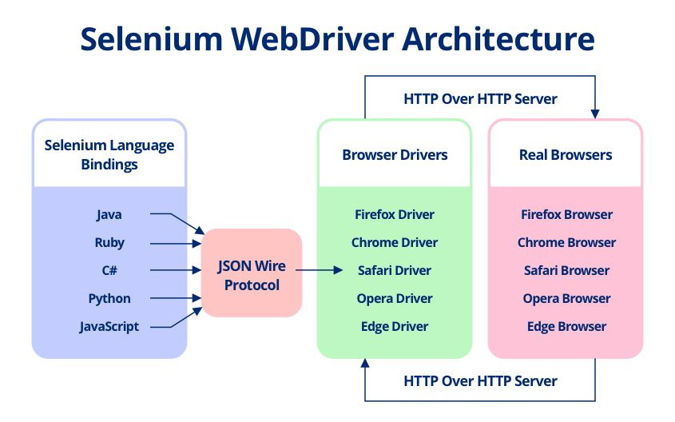
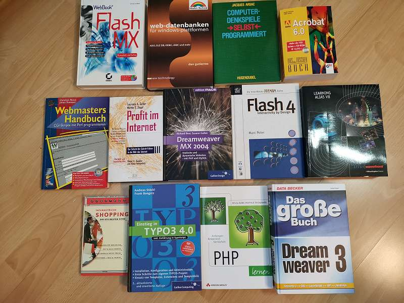

## Weg mit Selenium - Integrationstests mit Cypress

---


#### Alexander Heimbuch
[@zusatzstoff](https://twitter.com/zusatzstoff)  
[alexander.heimbu.ch](https://alexander.heimbu.ch)  
[github.com/alexander-heimbuch](https://github.com/alexander-heimbuch)  

---

## Agenda

1. Anforderungen
2. Selenium
3. Cypress
4. Demo!
5. Tradeoffs

---

## 1. Anforderungen

----

### Anforderungen von UIs

- UIs sind asynchron
- Clientseitinge Applikationen
- Komplexe Nutzerflows
- Schnellebiges Ökosystem

----

### Anforderungen von Entwicklern

- Basis für die Weiterentwicklung
- Große Entwicklerteams
- Schnelle und einfache Entwicklung
- Viele Tests, schnell ausführbar

Note:

- Tests sind Werkzeuge für Entwicklenr
- Sicherheitsgrut der Softwareentwicklung

----

### Anforderungen an Integrationstests 

- Entwicklertooling
- Stabilität
- Schnelligkeit
- Parallelisierbarkeit

---

## 2. Selenium

> UIs sind asynchron, Selenium ist es nicht

----

### Selenium Webdriver Architektur



Note:

- Jedes Seleniumkommando wird via HTTP Request zum Webdriver geschickt und ausgeführt
- Status wird züruck an Selenium Controller geschickt

----

### Das Grundproblem



Note:
- Vielzahl an asynchronen Prozessen im UI:
- Dynamische Elemente, Http Calls, CSS Transitions
- Testrunner ist es nicht möglich Zustand der Applikation festzustellen

----

### Workaround an Workaround

- Element Polling
- HTTP Call Analysen
- Künstliche Wartezeiten
- Langsame und instabile Tests

---

## 3. Cypress

> A Testrunner for Humans

----

### Runtime

- Tests werden im Browser ausgeführt
- Zugriff auf Document, Window, Events
- Tests müssen asynchron sein

----

### Testrunner

<video autoplay="" loop="" muted="" playsinline="" controls="" class="" poster="https://docs.cypress.io/img/snippets/selector-playground.f4c8a7a8.png" style="width:100%">
    <source type="video/mp4" src="https://docs.cypress.io/img/snippets/selector-playground.08527209.mp4">
</video>

----

### Testogranisation

```javascript
describe('Hooks', function() {
  before(function() {
    // runs once before all tests in the block
  })

  after(function() {
    // runs once after all tests in the block
  })

  beforeEach(function() {
    // runs before each test in the block
  })

  afterEach(function() {
    // runs after each test in the block
  })

  it(function() {
    // the test
  })
})
```

Note:
- An Mocha angelehnt

----

### Assertions

Chai
```javascript
expect(name).to.not.equal('Jane')
```

Sinon Chai jQuery
```javascript
expect($el).to.have.attr('foo', 'bar')
```

Cypress Should Wrapper
```javascript
cy.get('li.selected').should('have.length', 3)
```

Note:
- BDD Assertions auf Basis von Chai
- Sinon Chai + jQuery
- Should helper für cy.wrapper

----

### Chainable Commands

Wrapper
```javascript
cy.wrap($el).click() // wraps dom element
```
Navigation
```javascript
cy.visit('http://localhost:3000') // navigate
```
Chainable Commands
```javascript
cy
  .get('nav')                          // yields <nav>
  .should('be.visible')                // yields <nav>
  .should('have.css', 'font-family')   // yields 'sans-serif'
  .and('match', /serif/)               // yields 'sans-serif'
```
API Mocking
```javascript
cy.server()
cy.route('https://localhost:7777/users', 
    [{ id: 1, name: 'Pat' }]
)
```

----

### Fixtures

```javascript
cy.fixture('users').as('usersJson') 
// load data from users.json

cy.fixture('logo.png').then((logo) => {
  // load data from logo.png
})

cy.route('GET', '/users/**', 'fixture:users')
```

----

### Tasks

```javascript
// in test
describe('e2e', () => {
  beforeEach(() => {
    cy.task('defaults:db')
    cy.visit('/')
  })

  it('displays article values', () => {
    cy.get('.article-list')
      .should('have.length', 10)
  })
})
```

----

### Tasks

```javascript
// in plugins/index.js
// we require some code in our app that
// is responsible for seeding our database
const db = require('../../server/src/db')

module.exports = (on, config) => {
  on('task', {
    'defaults:db': () => {
      return db.seed('defaults')
    }
  })
}
```

----

### Dashboard


Note:
- Open Source As A Service
- Screen Recording
- Tests Reporting

----

### Parallelisierung


Note:
- Dashboard Feature
- Sonst eigene Implementierung

---

## 4. Demo!

---

## 4. Tradeoffs

- Limitiert auf Chrome (Firefox, IE, Safari in Entwicklung)
- Läuft innerhalb des Browsers:
    - Kein Multi Tab support
    - Eine test suite pro browser gleichzeitig
    - Single Origin
    - Seiteneffekte auf Applikation